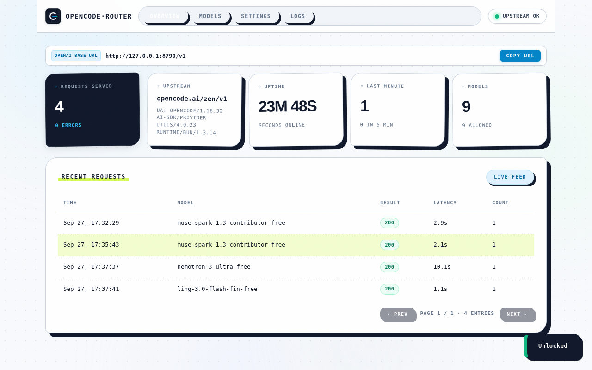
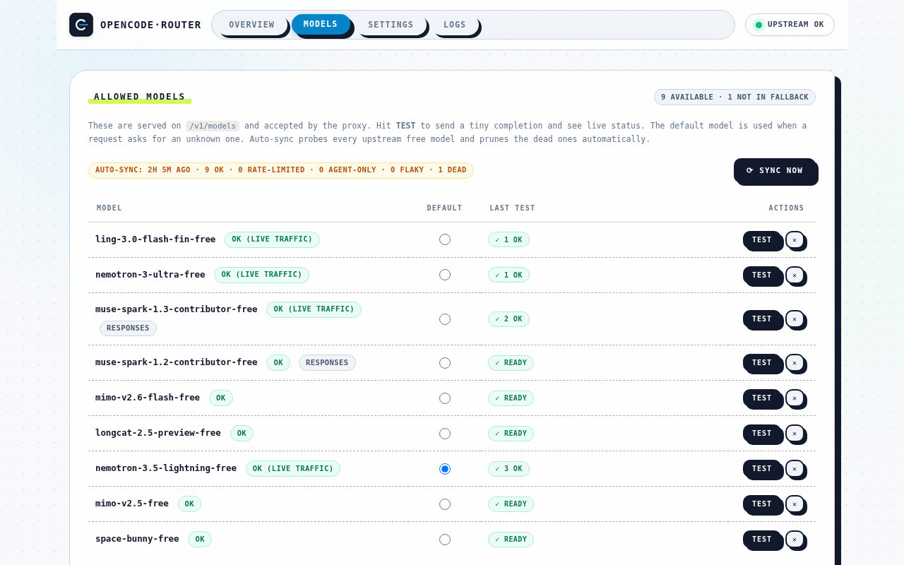

<div align="center">

  

  # OpenCode Router

  **High-performance, ultra-lightweight AI model gateway and proxy engine written in Go.**  
  *Unlocks official upstream models with sub-millisecond overhead, automatic failover, and full OpenAI compatibility.*

  <p>
    <a href="https://github.com/G-Aman/opencode-router/releases"></a>
    <a href="https://github.com/G-Aman/opencode-router/actions/workflows/release.yml"></a>
    <a href="https://go.dev/"></a>
    <a href="https://github.com/G-Aman/opencode-router/pkgs/container/opencode-router"></a>
    <a href="LICENSE"></a>
  </p>

</div>

---

## ⚡ Highlights

- **Near-Zero Footprint:** Compiled static Go binary consuming **< 10 MB RAM** and **0.0% idle CPU**. Runs smoothly on single-board computers and OpenWrt routers with as little as 64 MB RAM.
- **Client Runtime Mimic:** Seamlessly emulates official client headers and request envelopes to ensure 100% upstream model availability.
- **OpenAI `/v1` Drop-in Replacement:** Standard `/v1/chat/completions` and `/v1/models` endpoints compatible with Cursor, Continue, Cline, LibreChat, OpenAI SDKs, and OpenAI-compatible tools.
- **Smart Model Synchronization:** Continuously tracks and syncs healthy free-tier and contributor models from upstream registries without requiring service restarts.
- **Resilient Fallback Engine:** Automatic real-time cascading failover to alternate models when an upstream endpoint hits rate limits (429) or transient downtime (5xx).
- **Embedded Control Dashboard:** Clean, responsive WebUI for real-time latency inspection, traffic monitoring, one-click API base URL copying, and dynamic configuration.

---

## 📸 WebUI Preview

<div align="center">
  
</div>

<br/>

<details>
  <summary><b>🔍 Click to view high-resolution static slides manually</b></summary>
  <br/>

  #### 1. Overview & Real-Time Metrics
  <p align="center">
    
  </p>

  #### 2. Model Catalog & Status
  <p align="center">
    
  </p>
</details>

---

## 🚀 Quick Start

### 1. Download Pre-Compiled Binaries

Download ready-to-run release packages directly from the [**Releases Page**](https://github.com/G-Aman/opencode-router/releases):

| OS / Target | Architecture | Direct Package Link |
| :--- | :--- | :--- |
| **Linux (Standard 64-bit)** | `x86_64 / amd64` | [Download AMD64 ZIP](https://github.com/G-Aman/opencode-router/releases/latest/download/opencode-router-linux-amd64.zip) |
| **Linux (ARM 64-bit)** | `arm64 / aarch64` | [Download ARM64 ZIP](https://github.com/G-Aman/opencode-router/releases/latest/download/opencode-router-linux-arm64.zip) |
| **Linux (ARM 32-bit)** | `armv7 / armv5` | [Download ARMv7 ZIP](https://github.com/G-Aman/opencode-router/releases/latest/download/opencode-router-linux-armv7.zip) · [ARMv5](https://github.com/G-Aman/opencode-router/releases/latest/download/opencode-router-linux-armv5.zip) |
| **OpenWrt Router** | `mipsle (MT7628 / TL-MR3020)` | [Download MIPSLE Soft-Float ZIP](https://github.com/G-Aman/opencode-router/releases/latest/download/opencode-router-linux-mipsle-softfloat.zip) |
| **OpenWrt Router** | `mipsle (MT7621)` | [Download MIPSLE Hard-Float ZIP](https://github.com/G-Aman/opencode-router/releases/latest/download/opencode-router-linux-mipsle-hardfloat.zip) |
| **OpenWrt Router** | `mips (Atheros AR9331)` | [Download MIPS Soft-Float ZIP](https://github.com/G-Aman/opencode-router/releases/latest/download/opencode-router-linux-mips-softfloat.zip) |
| **macOS (Apple Silicon)** | `M1 / M2 / M3 / M4 (arm64)` | [Download macOS ARM64 ZIP](https://github.com/G-Aman/opencode-router/releases/latest/download/opencode-router-darwin-arm64.zip) |
| **macOS (Intel)** | `x86_64 / amd64` | [Download macOS Intel ZIP](https://github.com/G-Aman/opencode-router/releases/latest/download/opencode-router-darwin-amd64.zip) |
| **Windows** | `64-bit (amd64)` | [Download Windows AMD64 ZIP](https://github.com/G-Aman/opencode-router/releases/latest/download/opencode-router-windows-amd64.zip) |
| **Windows (ARM)** | `arm64` | [Download Windows ARM64 ZIP](https://github.com/G-Aman/opencode-router/releases/latest/download/opencode-router-windows-arm64.zip) |

```bash
# Extract and launch (default port: 8787)
./opencode-router

# Or specify a custom listening port
./opencode-router 8790
```

### 2. Docker & Container Platforms

Run the official multi-arch container image (`linux/amd64`, `linux/arm64`, `linux/arm/v7`):

```bash
docker run -d \
  --name opencode-router \
  --restart unless-stopped \
  -p 8787:8787 \
  -v $(pwd)/opencode-router.json:/app/opencode-router.json \
  ghcr.io/g-aman/opencode-router:latest
```

Using Docker Compose:

```yaml
version: '3.8'
services:
  opencode-router:
    image: ghcr.io/g-aman/opencode-router:latest
    container_name: opencode-router
    restart: unless-stopped
    ports:
      - "8787:8787"
    volumes:
      - ./data:/app/data
```

### 3. Running Inside Existing CLIProxy / Docker Containers

If you are running **CLIProxyAPI** (or other gateway containers) and want OpenCode Router to run as a sidecar process directly inside the container without creating separate network boundaries:

1. **Mount the extracted release directory** into your container (for example under `/CLIProxyAPI/plugins/opencode-router`):
   ```yaml
   volumes:
     - /path/to/opencode-router:/CLIProxyAPI/plugins/opencode-router
   ```

2. **Override the container startup command** to launch OpenCode Router in the background before executing `CLIProxyAPI`:
   ```yaml
   command: ["sh", "-c", "/CLIProxyAPI/plugins/opencode-router/start.sh && exec ./CLIProxyAPI"]
   ```

3. **In Docker Run CLI**:
   ```bash
   docker run -d \
     --name cliproxy \
     -p 8000:8000 \
     -p 8787:8787 \
     -v /opt/opencode-router:/CLIProxyAPI/plugins/opencode-router \
     my-cliproxy-image:latest \
     sh -c "/CLIProxyAPI/plugins/opencode-router/start.sh && exec ./CLIProxyAPI"
   ```
   > **Note on Port 8787:** Exposing `-p 8787:8787` is optional. Keep it exposed if you wish to access the OpenCode Router WebUI directly in your browser (`http://<host-ip>:8787/`) for real-time monitoring and model inspection.

4. **Connect in CLIProxy WebUI**:
   - Go to your CLIProxy management WebUI.
   - Add a new **Custom OpenAI Provider**:
     - **Base URL**: `http://127.0.0.1:8787/v1`
     - **API Key**: Leave empty (if `proxyKey` is default) or enter your configured key.
   - Now CLIProxy routes directly to OpenCode Router via internal localhost loopback with zero network overhead.

### 4. Build from Source

Requirements: Go 1.22+

```bash
git clone https://github.com/G-Aman/opencode-router.git
cd opencode-router
go build -trimpath -ldflags="-s -w" -o opencode-router .
./opencode-router
```

---

## 💻 Supported Target Platforms

OpenCode Router compiles to standalone, statically linked binaries with zero shared library dependencies:

| Platform | Architecture | Supported Targets |
| :--- | :--- | :--- |
| **Linux** | `amd64`, `arm64`, `armv7`, `armv5` | Ubuntu, Debian, Alpine, Raspberry Pi, VPS |
| **OpenWrt** | `mipsle` (soft/hard float), `mips` | MediaTek MT7628, MT7620, MT7621, Atheros AR9331 |
| **macOS** | `arm64`, `amd64` | Apple Silicon (M1/M2/M3/M4), Intel Macs |
| **Windows** | `amd64`, `arm64` | Windows 10/11, Windows Server |

---

## 🛠️ Usage with AI Clients

Set the Base URL in your AI coding tool or client application:

* **OpenAI Base URL:** `http://localhost:8787/v1` (or your server's Tailscale/LAN IP)
* **API Key:** Leave empty, or provide your configured `Proxy Key`

### Example: Python OpenAI SDK
```python
from openai import OpenAI

client = OpenAI(
    base_url="http://localhost:8787/v1",
    api_key="your-proxy-key" # Optional if proxy key is empty
)

response = client.chat.completions.create(
    model="muse-spark-1.3-contributor-free",
    messages=[{"role": "user", "content": "Hello world!"}],
    stream=True
)

for chunk in response:
    content = chunk.choices[0].delta.content or ""
    print(content, end="", flush=True)
```

### Example: cURL
```bash
curl http://localhost:8787/v1/chat/completions \
  -H "Content-Type: application/json" \
  -d '{
    "model": "muse-spark-1.3-contributor-free",
    "messages": [{"role": "user", "content": "Ping!"}]
  }'
```

---

## ⚙️ Configuration

The router auto-generates `opencode-router.json` on first run if not present. All settings can also be modified directly from the WebUI:

```json
{
  "host": "0.0.0.0",
  "port": 8787,
  "proxyKey": "",
  "upstream": "https://opencode.ai/zen/v1",
  "defaultModel": "nemotron-3.5-lightning-free",
  "fallbackModels": [
    "ling-3.0-flash-fin-free",
    "nemotron-3-ultra-free",
    "muse-spark-1.3-contributor-free",
    "mimo-v2.6-flash-free"
  ],
  "modelAliases": {},
  "autoSyncModels": true,
  "autoSyncIntervalMs": 900000,
  "autoUA": true
}
```

### Configuration Options:
* `host` *(string)*: Listening interface (`0.0.0.0` for all interfaces).
* `port` *(int)*: Listening port (default `8787`).
* `proxyKey` *(string)*: Optional authentication key for your gateway. Keep empty for open access.
* `upstream` *(string)*: Upstream endpoint target.
* `autoUA` *(bool)*: Automatically track upstream releases and sync client User-Agent envelopes.
* `fallbackModels` *(array)*: Priority order for automatic failover when a model encounters a 429 rate limit or outage.

---

## 📄 License

This project is licensed under the [MIT License](LICENSE).
